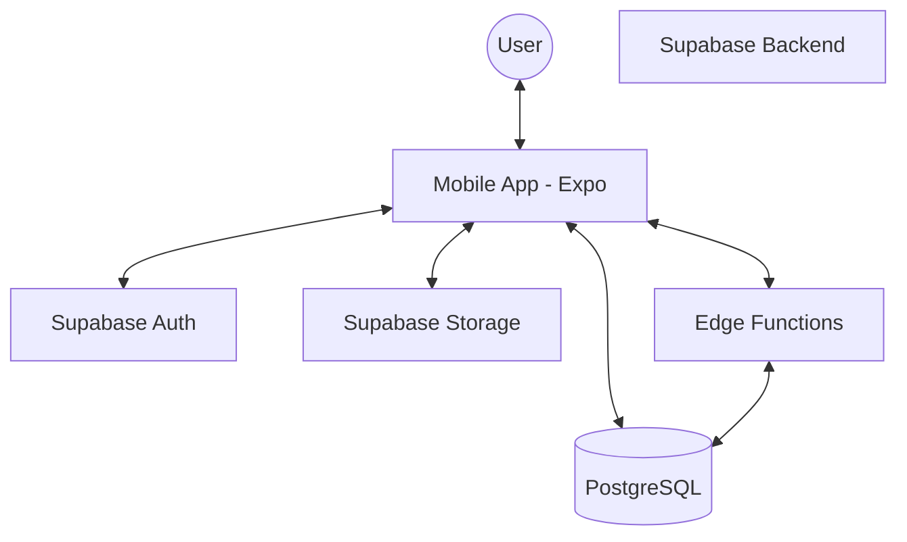

# EasySplit: Group Expense Tracker

EasySplit is a mobile application designed for debt-splitting and group expense management, optimized specifically for Vietnamese users. It simplifies the process of tracking shared costs and settling debts within various groups.

## Core Features

- **Group Management**: Create groups and invite members via unique invite codes.
- **Expense Logging**: Log expenses with descriptions, categories, and image receipts.
- **Automated Debt Calculation**: Automatically calculate who owes whom based on expense splits.
- **Debt Settlement**: Facilitate settlements with proof of transfer (images) and creditor confirmation.
- **Group Statistics**: Per-member spending and contribution charts for each group.
- **Group Funds**: Pool money toward shared goals and track member contributions.
- **Group Chat**: In-group messaging with image attachments.
- **Internationalization (i18n)**: Full English / Vietnamese support, auto-detecting the device locale and switchable in Settings.
- **Theming**: Light / Dark / System appearance modes.

## System Architecture

The application follows a modern mobile-client to backend-as-a-service architecture.



## Tech Stack

### Frontend
- **Framework**: React Native (Expo)
- **Routing**: Expo Router
- **Styling**: NativeWind (Tailwind CSS)
- **State Management**: Zustand
- **Localization**: i18next + react-i18next (en / vi); device-locale detection via the Hermes `Intl` API (no native module required)

### Backend (Supabase)
- **Database**: PostgreSQL
- **Authentication**: Supabase Auth
- **Storage**: Supabase Storage (Receipts & Proof of Transfer)
- **Serverless Logic**: Supabase Edge Functions

## Database Schema

The database consists of the following primary entities:

| Table | Description |
| :--- | :--- |
| `profiles` | User profile information (Linked to Supabase Auth). |
| `groups` | Expense groups created by users. |
| `group_members` | Junction table for group membership and roles. |
| `expenses` | Recorded expenses within a group. |
| `expense_splits` | Breakdown of how an expense is divided among members. |
| `debt_settlements` | Records of debt payments and their status. |
| `categories` | Expense categories (optionally scoped per group). |
| `fundings` | Group shared funds with a target amount. |
| `fund_contributions` | Member contributions toward a fund (with proof + status). |
| `messages` | Group chat messages. |
| `media` | Attachments linked to messages. |
| `notifications` | Per-user in-app notifications (used by the upcoming push/notifications work). |

### Relationships

- `profiles (user_id)` -> `auth.users (id)`
- `group_members (user_id)` -> `profiles (user_id)`
- `group_members (group_id)` -> `groups (group_id)`
- `expenses (group_id)` -> `groups (group_id)`
- `expenses (payer_id)` -> `profiles (user_id)`
- `expense_splits (expense_id)` -> `expenses (expense_id)`
- `expense_splits (user_id)` -> `profiles (user_id)`
- `debt_settlements (group_id)` -> `groups (group_id)`
- `debt_settlements (debtor_id)` -> `profiles (user_id)`
- `debt_settlements (creditor_id)` -> `profiles (user_id)`

## Folder Structure

```text
.
├── mobile-app/
│   ├── app/            # Expo Router screens (File-based routing)
│   ├── src/
│   │   ├── api/        # Supabase client and API call definitions
│   │   ├── components/ # Reusable UI components
│   │   ├── store/      # Zustand store definitions
│   │   ├── hooks/      # Custom React hooks
│   │   └── types/      # TypeScript type definitions
│   └── ...
└── supabase/
    ├── migrations/     # SQL schema and database migrations
    ├── functions/      # Edge Functions for complex server-side logic
    └── ...
```

## Naming Conventions

- **Frontend (Mobile App)**: `CamelCase` for components and files, `camelCase` for variables and functions.
- **Database (Supabase)**: `snake_case` for table names, column names, and functions.

## Business Rules

1.  **Mandatory Profiles**: Every user must have a record in the `profiles` table, typically triggered by successful Supabase Authentication.
2.  **Expense Splitting**: Expenses must be split among group members. The sum of splits must equal the total expense amount.
3.  **Settlement Confirmation**: A debt settlement remains in a pending state until the creditor explicitly confirms receipt of payment.

## Setup Instructions

### Prerequisites
- Node.js (v18+)
- Supabase CLI
- Expo CLI

### Local Development
1. Clone the repository.
2. Install dependencies: `cd mobile-app && npm install`.
3. Configure environment variables (create `.env` in `mobile-app/`).
4. Start the dev server: `npx expo start`.
