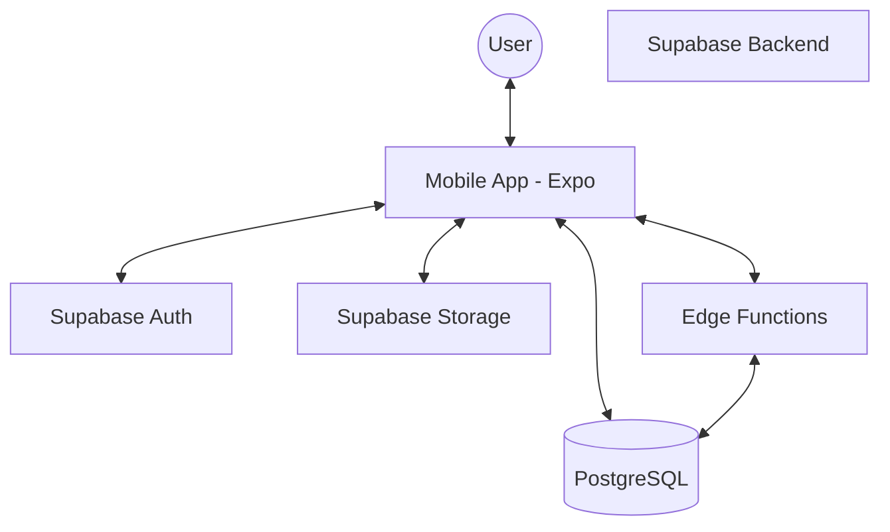

# EasySplit: Group Expense Tracker

EasySplit is a mobile application designed for debt-splitting and group expense management, optimized specifically for Vietnamese users. It simplifies the process of tracking shared costs and settling debts within various groups.

## Core Features

- **Group Management**: Create groups and invite members via unique invite codes.
- **Expense Logging**: Log expenses with descriptions, categories, and image receipts.
- **Automated Debt Calculation**: Automatically calculate who owes whom based on expense splits.
- **Debt Settlement**: Facilitate settlements with proof of transfer (images) and creditor confirmation.
- **Group Statistics**: Per-member spending and contribution charts for each group.
- **Group Funds**: Pool money toward shared goals and track member contributions.
- **Group Chat**: In-group messaging with image attachments.
- **Internationalization (i18n)**: Full English / Vietnamese support, auto-detecting the device locale and switchable in Settings.
- **Theming**: Light / Dark / System appearance modes.

## System Architecture

The application follows a modern mobile-client to backend-as-a-service architecture.



## Tech Stack

### Frontend
- **Framework**: React Native (Expo)
- **Routing**: Expo Router
- **Styling**: NativeWind (Tailwind CSS)
- **State Management**: Zustand
- **Localization**: i18next + react-i18next (en / vi); device-locale detection via the Hermes `Intl` API (no native module required)

### Backend (Supabase)
- **Database**: PostgreSQL
- **Authentication**: Supabase Auth
- **Storage**: Supabase Storage (Receipts & Proof of Transfer)
- **Serverless Logic**: Supabase Edge Functions

## Database Schema

The database consists of the following primary entities:

| Table | Description |
| :--- | :--- |
| `profiles` | User profile information (Linked to Supabase Auth). |
| `groups` | Expense groups created by users. |
| `group_members` | Junction table for group membership and roles. |
| `expenses` | Recorded expenses within a group. |
| `expense_splits` | Breakdown of how an expense is divided among members. |
| `debt_settlements` | Records of debt payments and their status. |
| `categories` | Expense categories (optionally scoped per group). |
| `fundings` | Group shared funds with a target amount. |
| `fund_contributions` | Member contributions toward a fund (with proof + status). |
| `messages` | Group chat messages. |
| `media` | Attachments linked to messages. |
| `notifications` | Per-user in-app notifications (used by the upcoming push/notifications work). |

### Relationships

- `profiles (user_id)` -> `auth.users (id)`
- `group_members (user_id)` -> `profiles (user_id)`
- `group_members (group_id)` -> `groups (group_id)`
- `expenses (group_id)` -> `groups (group_id)`
- `expenses (payer_id)` -> `profiles (user_id)`
- `expense_splits (expense_id)` -> `expenses (expense_id)`
- `expense_splits (user_id)` -> `profiles (user_id)`
- `debt_settlements (group_id)` -> `groups (group_id)`
- `debt_settlements (debtor_id)` -> `profiles (user_id)`
- `debt_settlements (creditor_id)` -> `profiles (user_id)`

## Folder Structure

```text
.
├── mobile-app/
│   ├── app/            # Expo Router screens (File-based routing)
│   ├── src/
│   │   ├── api/        # Supabase client and API call definitions
│   │   ├── components/ # Reusable UI components
│   │   ├── store/      # Zustand store definitions
│   │   ├── hooks/      # Custom React hooks
│   │   └── types/      # TypeScript type definitions
│   └── ...
└── supabase/
    ├── migrations/     # SQL schema and database migrations
    ├── functions/      # Edge Functions for complex server-side logic
    └── ...
```

## Naming Conventions

- **Frontend (Mobile App)**: `CamelCase` for components and files, `camelCase` for variables and functions.
- **Database (Supabase)**: `snake_case` for table names, column names, and functions.

## Business Rules

1.  **Mandatory Profiles**: Every user must have a record in the `profiles` table, typically triggered by successful Supabase Authentication.
2.  **Expense Splitting**: Expenses must be split among group members. The sum of splits must equal the total expense amount.
3.  **Settlement Confirmation**: A debt settlement remains in a pending state until the creditor explicitly confirms receipt of payment.

## Feature Status & Roadmap

Tracking the remediation of UI surfaces that previously had no working flow ("dead flows"). Work is sequenced into batches by risk/impact.

### ✅ Batch 1 — Quick wins (done, frontend-only)
- **Statistics screen wired up**: added a chart button to the group header → `/group/[id]/stats` (screen existed but was unreachable).
- **Group funds wired up**: the group "Funds" tab now opens the real fund-management screen instead of a "coming soon" placeholder.
- **Expense category persisted**: the category picker in *Add expense* now saves the selected category to `expenses.category` (was hard-coded to `others`).
- **Removed "Rate the app"** no-op row from Help.
- **Removed the fake "Online" status** in group chat.

Post-test fixes:
- Member names rendered as `undefined` on the Statistics / Members screens — the service now flattens the joined profile so every consumer reads `member.full_name` directly.
- The saved expense category is now shown in the group's transaction history so it is verifiable in-app.
- **Funds feature reconciled & completed**:
  - Schema drift fixed — the manually-created `fundings`/`fund_contributions` tables (which used `title` instead of `name` and lacked columns) are recreated cleanly in migration `20260317000000`; missing INSERT/UPDATE RLS policies were added so creating funds and contributions actually works.
  - Storage bucket `attachments` (+ policies) created in migration `20260318000000` — fixed "Bucket not found" on proof uploads.
  - Fund list now refetches on screen focus + pull-to-refresh, so a newly created fund always appears.
  - Admin (group creator) can now **confirm** pending contributions (`20260319000000` adds the update policy); a fund's progress / current amount is computed from confirmed contributions.

> Migration lesson learned: never edit an already-applied migration (the CLI skips it) and avoid `CREATE TABLE IF NOT EXISTS` for tables that may already exist in a different shape — add follow-up migrations with `ALTER ... ADD COLUMN IF NOT EXISTS` / `DROP POLICY IF EXISTS` instead, and reload the PostgREST cache (`NOTIFY pgrst, 'reload schema';`) after schema changes.

### ✅ Batch 2 — Frontend + light auth (done)
- **Group budget** — the group overview shows a spent-vs-budget bar (turning red when exceeded) and is now **settable/editable in-place**: groups without a budget show a "Set group budget" prompt; tapping an existing bar lets you edit it (persists to `groups.budget_amount`).
- **"Add member" → share invite code** — the Members header button now opens the native share sheet with the group's invite code.
- **Forgot password** — the login "Forgot?" link sends a reset email via `supabase.auth.resetPasswordForEmail`.
- **Biometric app-lock** — `expo-local-authentication` + `useSecurityStore` (preference in SecureStore). Toggle in Security settings; the app shows a lock screen (Face ID / fingerprint) on launch and whenever it returns from the background. **Requires a dev-client rebuild** (new native module): `npx expo prebuild -p ios && npx expo run:ios`.

### ✅ Batch 3 — Requires DB / RLS (done)
- **Remove member** — real delete from `group_members`, gated to the group owner in the UI and enforced by a new owner-only DELETE RLS policy (`20260320000000`). The owner cannot remove themselves.
- **Global Expenses tab** — the center tab now lists every expense across all of the user's groups (RLS-scoped), newest first, tapping an item opens its group. (`getUserExpensesFeed` + `useExpensesFeed`.)
- **Global Debts tab** — un-hidden in the tab bar (the deferred Notifications tab took its place; see note); shows aggregated owed/owe totals plus a per-group net breakdown. (`getUserDebtsByGroup` + `useDebtsOverview`.)
- Fixed a settlement-status mismatch: balance math now counts `confirmed` settlements (the app never writes `paid`), so confirmed payments correctly reduce balances on the Home and Debts screens.

> Tab bar note: the bottom bar keeps 5 slots with the center FAB. Since the Notifications tab (#15) is deferred, it was hidden (`href: null`) and the new **Debts** tab took its place. Notifications returns to the bar when its feature ships in Batch 4.

### 🔄 Batch 4 — Infrastructure (in progress)
- ✅ **Terms of Service & Privacy Policy** — drafted in-app (no external hosting): bilingual content in `src/content/legal.ts`, shown on `app/settings/legal.tsx` (Terms/Privacy toggle), linked from the Help screen. Placeholders ([date], [Company]) and a "get legal review" note remain.
- ✅ **In-app notifications** — DB triggers (`20260321000000`) write rows into the `notifications` table on key events (new expense → other members; settlement submitted → creditor; settlement confirmed → debtor). A new top-level `app/notifications.tsx` screen renders them (localized from `data.type`, unread highlighting, mark-read on leave); the Home header has a bell with an unread badge. No device / Edge Function / rebuild required.
- ⏳ **Push-to-device** (`expo-notifications` + `profiles.expo_push_token` + Edge Function) — deferred until a physical iOS device is available; it layers on top of the in-app notifications already wired here.
- Full forgot-password deep-link screen; optional 2FA via Supabase MFA (TOTP) (deferred).

> Deferred to a later enhancement pass: persisting notification-preference toggles, the static "notifications on" label, and presence/online status.

## Setup Instructions

### Prerequisites
- Node.js (v18+)
- Supabase CLI
- Expo CLI

### Local Development
1. Clone the repository.
2. Install dependencies: `cd mobile-app && npm install`.
3. Configure environment variables (create `.env` in `mobile-app/`).
4. Start the dev server: `npx expo start`.
