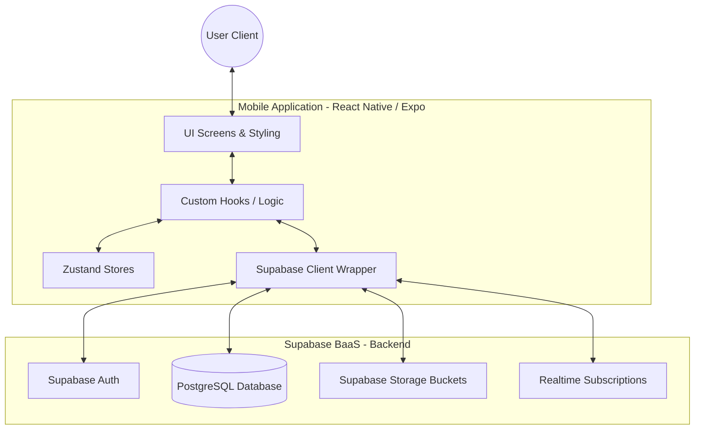
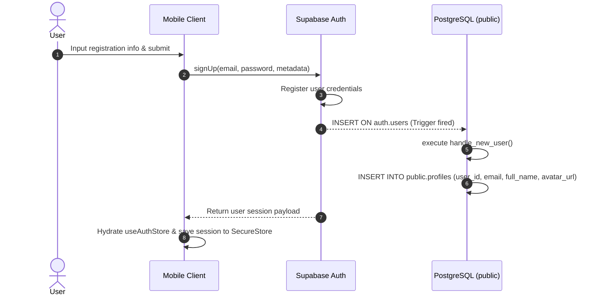
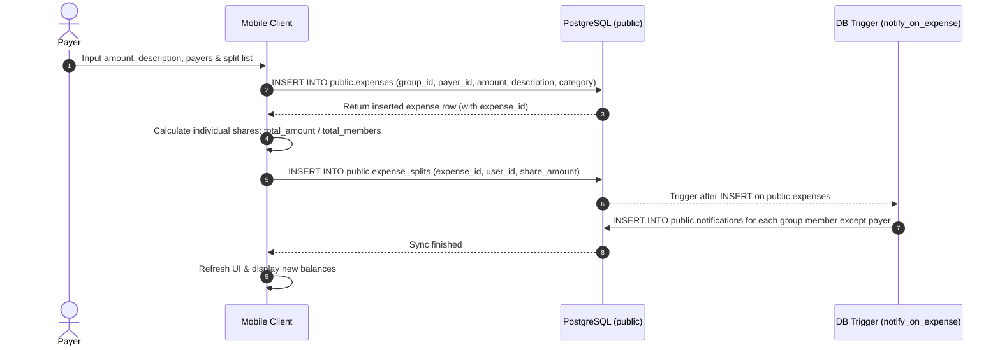
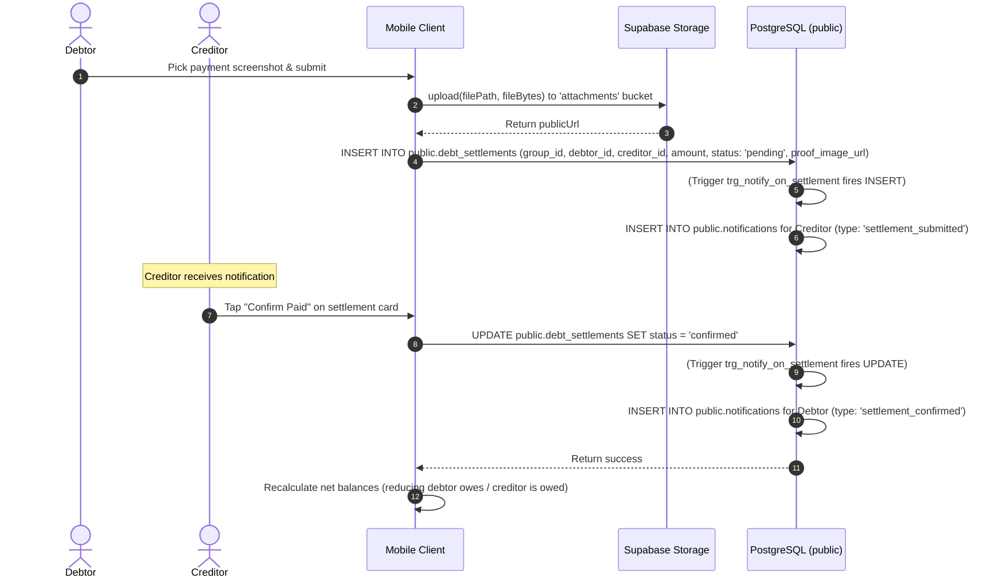

# Technical Specification: EasySplit Project

## 1. Project Overview & Architecture

### 1.1 System Architecture
EasySplit is designed as a client-server web/mobile application utilizing a **Backend-as-a-Service (BaaS)** pattern:
*   **Mobile Client**: Built using **React Native (Expo SDK 55)**. It follows a file-based routing architecture using `expo-router` and implements a clean local architecture featuring:
    *   **UI Layer (Views)**: React Native screens styled with Tailwind CSS via **NativeWind v4** and animated using `react-native-reanimated`.
    *   **Business Logic Layer (Hooks)**: Custom React Hooks encapsulate logic for data fetching, transaction operations, and state bindings.
    *   **State Management Layer (Zustand)**: Global client-side states (e.g., authentication session, localization preference, biometric app-lock preference, color theme mode) are handled using lightweight Zustand stores.
    *   **Data Access Layer (Supabase Client & Services)**: Consumed directly by hooks to perform queries, uploads, real-time syncs, and database updates.
*   **Backend & Infrastructure (Supabase)**:
    *   **Relational Database (PostgreSQL)**: Handles transactional tables, foreign keys, indices, and data integrity.
    *   **Object Storage (Supabase Storage)**: Holds files uploaded from the client inside the public `attachments` bucket (receipt image attachments, debt proof documents, fund contributions).
    *   **Authentication (Supabase Auth)**: Processes email/password registration, password resetting, login authentication, and issues JSON Web Tokens (JWT) for secure requests.
    *   **Realtime Subscriptions**: Synchronizes group chats and in-app badges over WebSocket streams directly from PostgreSQL changes.
    *   **Database Triggers & RPC Functions**: PostgreSQL-native functions automate profile population on signup, process secure invite code actions bypassing row-level restrictions, and generate in-app alerts on table inserts or updates.
*   **Mock Backend System**:
    *   Located under `backend/src/`. Shows a reference **MVC/Layered Clean Architecture** pattern in TypeScript.
    *   Divided into:
        *   **Controllers** (`group.controller.ts`): Exposes mock routing decorators (`@Controller`, `@Post`, `@Body`) and request authentication guards.
        *   **Services** (`group.service.ts`): Handles high-level logic (e.g., generating invite codes).
        *   **Repositories** (`group.repository.ts`): Implements generic `ICrudRepository` data access interfaces.
        *   **Models** (`group.model.ts`): Standardizes structural database interfaces.



---

### 1.2 Directory Structure Breakdown

```text
.
├── backend/                  # Reference Mock Backend Module
│   ├── src/
│   │   ├── common/           # Backend-wide shared abstractions
│   │   │   ├── guards/       # Mock request authorization middleware (auth.guard.ts)
│   │   │   └── interfaces/   # Generic patterns (crud.interface.ts)
│   │   └── modules/          # Domain business modules
│   │       └── groups/       # Group business logic (controller, service, repository, model)
│   └── tsconfig.json         # TypeScript compiler config for mock backend
├── supabase/                 # Supabase Infrastructure Configuration
│   ├── migrations/           # Database migration files containing SQL schemas
│   ├── config.toml           # Supabase CLI dashboard configurations
│   └── seed.sql              # Database seed data script
└── mobile-app/               # Expo React Native Frontend Client
    ├── app/                  # File-based App Routes (Expo Router)
    │   ├── (auth)/           # Authentication flows (login, register)
    │   ├── (tabs)/           # Core tab bar pages (Home, Debts, Expenses, Settings)
    │   ├── group/            # Specific group dashboard layouts and inner screens
    │   │   ├── [id].tsx      # Main group detail screen (Expenses / Settlements / Funds tabs)
    │   │   └── [id]/         # Nested routes for group activities
    │   │       ├── add-expense.tsx     # Add new group transaction
    │   │       ├── chat.tsx            # Real-time room messages
    │   │       ├── fund-management.tsx # Co-contribution piggy bank manager
    │   │       ├── members.tsx         # Member admin settings
    │   │       └── stats.tsx           # Charts for spending ratio breakdown
    │   ├── settings/         # Specific preference setups (Appearance, Profile, Security)
    │   ├── index.tsx         # Entrance route redirector
    │   └── _layout.tsx       # Root configuration (Themes, biometric guards, fonts)
    ├── src/
    │   ├── api/              # Supabase Client initialisation & secure storage adapters
    │   ├── components/       # Shared UI components (Glass cards, input, buttons)
    │   ├── constants/        # System configuration values and defaults
    │   ├── hooks/            # Dedicated state and logic hooks
    │   ├── i18n/             # Multilingual configuration scripts (EN / VI)
    │   ├── services/         # Client API wrappers (Auth API, Group API)
    │   ├── store/            # Zustand global state declarations
    │   ├── theme/            # Layout color grids and system assets
    │   ├── types/            # App-level custom types & models
    │   └── utils/            # Shared calculations (currency, debts, formatters)
    ├── package.json          # Mobile dependencies manifest
    └── tsconfig.json         # TypeScript compile configuration for client
```

---

## 2. Tech Stack & Dependencies

### 2.1 Technical Stack List
*   **Programming Languages**: TypeScript (Frontend Client, Mock Backend) and SQL (PostgreSQL database schemas, rules, triggers, functions).
*   **Mobile SDK**: **Expo SDK 55** (based on React Native).
*   **Database & Back-end Platform**: **Supabase BaaS** (bundling PostgreSQL v15+, Supabase Auth, Supabase Storage, and Real-time engines).
*   **Styling Engine**: **Tailwind CSS** (via **NativeWind v4**).

### 2.2 Core Package Dependencies (Parsed from `mobile-app/package.json`)

| Package Name | Version | Role in Project |
| :--- | :--- | :--- |
| `react` | `19.2.0` | Library for building components. |
| `react-native` | `0.83.6` | Mobile framework. |
| `expo` | `~55.0.23` | Native device framework wrapping React Native runtime. |
| `@supabase/supabase-js` | `^2.98.0` | Client to query Postgres, listen to Realtime updates, upload files, and authenticate users. |
| `zustand` | `^5.0.11` | Lightweight global store management for auth context, language choice, security lock options, and layout themes. |
| `expo-router` | `~55.0.14` | File-system-based routing engine translating folder paths to screen stacks. |
| `nativewind` | `^4.2.2` | Translates Tailwind utility styles into Native stylesheet configurations. |
| `tailwindcss` | `^3.4.17` | Utility-first styling compile dependencies. |
| `react-native-reanimated` | `4.2.1` | Native thread processing engine for fluid UI micro-animations. |
| `expo-secure-store` | `~55.0.13` | Accesses device keystores to encrypt and persist critical data (e.g. auth tokens, settings). |
| `expo-local-authentication` | `~55.0.14` | Accesses Face ID / Touch ID hardware for app-lock verification. |
| `react-native-chart-kit` | `^6.12.0` | Renders statistical charts (Bar charts, Pie charts) on stats dashboards. |
| `react-native-svg` | `15.15.3` | Vector graphics rendering support required by charts and icons. |
| `i18next` & `react-i18next` | `^26.3.1` | Dynamic language dictionary translation client (Vietnamese / English). |
| `lucide-react-native` | `^0.577.0` | Premium vector system icons. |
| `base64-arraybuffer` | `^1.0.2` | Converts base64 file buffers to array buffers for storage upload stream compatibility. |

---

## 3. Core Modules & Functional Flow

### 3.1 Functional Modules Overview

1.  **Authentication & Profile Setup**:
    *   Email & Password login/register operations.
    *   Automatic profile registration on database level upon sign-up.
    *   **Custom Session Persistence**: `ExpoSecureStoreAdapter` splits JWT tokens exceeding 1900 bytes into chunks to circumvent SecureStore size limits on Android/iOS devices, avoiding login state drops.
    *   **Biometric Shield**: Gathers native hardware authentication. Locks screen instantly on app launch or on returning from background state.
2.  **Group Management**:
    *   Group creation, updating name descriptions, and configuring budget thresholds.
    *   Invitation management via generated unique 6-character strings.
    *   **Secure Join Transaction**: Users run the Postgres RPC method `join_group_by_code`, bypassing normal Row-Level Security reads on group lists to join via code.
    *   **Admin Control**: Group creators can remove members. Enforced by database RLS rules (`group_members` DELETE policy).
3.  **Expense Log & Distribution**:
    *   Expense entries tracking description, category, and total cost.
    *   **Calculated Splitting**: Splits are calculated on entry: `share_amount = total_amount / total_member_count`. Individual rows are added to `expense_splits`.
    *   **Global History**: A consolidated, cross-group timeline aggregating transactions from all groups of the logged-in user.
4.  **Debt Settlements**:
    *   **Graph Simplification Math**: Employs simplified transaction pathways to determine net balances across members (`simplifyDebts` logic).
    *   **Payment Submission**: Debtor uploads a transfer screenshot (uploaded to the `attachments` bucket) and creates a `debt_settlements` row (`status = 'pending'`).
    *   **Confirmation Receipt**: Creditors update the row to `confirmed` after verifying payment, which updates net balances.
5.  **Group Shared Funds**:
    *   Creates fundraising targets with custom goals.
    *   Members submit contribution deposits with image receipts.
    *   Group admins confirm pending contributions, automatically recalculating the fund's `current_amount`.
6.  **Realtime In-Group Chats**:
    *   Syncs group messaging using a WebSocket Postgres change listener channel.
    *   Supports text and multiple image attachments. Uploads files to storage inside the `chat/` prefix.
7.  **In-App Triggered Notifications**:
    *   Automates notifications for group actions (new expense, settlement proof submitted, payment confirmed, new message) using database-level triggers.

---

### 3.2 Client-Side Route Directory Layout

```text
app/
├── (auth)/
│   ├── login.tsx            # Login screen (Supabase email signIn + reset link)
│   └── register.tsx         # Sign-up screen (triggers profile automation on DB)
├── (tabs)/
│   ├── _layout.tsx          # Sets up bottom tab navigation bar
│   ├── index.tsx            # Home screen (overall balances, group lists)
│   ├── groups.tsx           # Group directory overview
│   ├── expenses.tsx         # Consolidated global expenses list
│   ├── debts.tsx            # Debts dashboard & per-group balances
│   └── settings.tsx         # Main settings index
├── group/
│   ├── [id].tsx             # Detailed view dashboard for a specific group
│   └── [id]/
│       ├── add-expense.tsx  # Add new group transaction & divide cost
│       ├── chat.tsx         # Live group messages with Postgres changes channel
│       ├── fund-management.tsx # Co-contribution fund manager
│       ├── members.tsx      # Admin tools: manage members and invite codes
│       └── stats.tsx        # Expense charts and breakdowns
├── settings/
│   ├── appearance.tsx       # Set color theme preferences (light/dark/system)
│   ├── help.tsx             # User guides & legal terms links
│   ├── language.tsx         # Select Vietnamese or English localization
│   ├── legal.tsx            # Terms of Service & Privacy Policy content
│   ├── notifications.tsx    # Notification settings layout
│   ├── profile.tsx          # Edit profile details (Full name, phone)
│   └── security.tsx         # Enable or disable biometric app-lock
├── notifications.tsx        # Global in-app notifications timeline
├── index.tsx                # Application entrance path router
└── _layout.tsx              # Root styles provider (fonts loading, biometric guard lock)
```

---

### 3.3 Core Execution Flows

#### Flow 1: User Signup and Profile Initialization


#### Flow 2: Recording an Expense & Calculating Split Shares


#### Flow 3: Submitting and Confirming Debt Settlement


---

## 4. Database Schema Specification

### 4.1 Table Specifications

#### 1. `profiles`
Stores user profile information. Primary key matches the auth user ID.
*   **Columns**:
    *   `user_id` (`uuid`, Primary Key): References `auth.users(id)` ON DELETE CASCADE.
    *   `full_name` (`text`, Not Null): Display name.
    *   `email` (`text`, Not Null, Unique): Email.
    *   `phone_number` (`character varying(15)`, Nullable): Contact phone number.
    *   `avatar_url` (`text`, Nullable): Avatar image url.
    *   `bank_info` (`jsonb`, Nullable): Bank info metadata.
    *   `created_at` (`timestamp with time zone`, Default: `now()`): Creation timestamp.

#### 2. `groups`
Stores expense groups created by users.
*   **Columns**:
    *   `group_id` (`uuid`, Primary Key): Default: `gen_random_uuid()`.
    *   `group_name` (`text`, Not Null): Group title.
    *   `invite_code` (`character varying(10)`, Not Null, Unique): 6-digit lookup code for joining.
    *   `description` (`text`, Nullable): Subtitle description.
    *   `created_by` (`uuid`, Nullable): References `profiles(user_id)`.
    *   `budget_amount` (`numeric(15,2)`, Nullable): Optional budget threshold.
    *   `group_avatar` (`text`, Nullable): Custom group cover banner.
    *   `created_at` (`timestamp with time zone`, Default: `now()`): Creation timestamp.

#### 3. `group_members`
Junction table mapping users to groups.
*   **Columns**:
    *   `group_id` (`uuid`, Primary Key Part): References `groups(group_id)` ON DELETE CASCADE.
    *   `user_id` (`uuid`, Primary Key Part): References `profiles(user_id)` ON DELETE CASCADE.
    *   `role` (`character varying(20)`, Default: `'member'`): Access role (`'admin'`, `'member'`).
    *   `joined_at` (`timestamp with time zone`, Default: `now()`): Join timestamp.
*   **Constraints**:
    *   Composite Primary Key: `(group_id, user_id)`.

#### 4. `expenses`
Stores transaction records within groups.
*   **Columns**:
    *   `expense_id` (`uuid`, Primary Key): Default: `gen_random_uuid()`.
    *   `group_id` (`uuid`, Nullable): References `groups(group_id)` ON DELETE CASCADE.
    *   `payer_id` (`uuid`, Nullable): References `profiles(user_id)`.
    *   `amount` (`numeric(15,2)`, Not Null): Total transaction amount.
    *   `description` (`text`, Nullable): What the expense was for.
    *   `category` (`character varying(50)`, Nullable): Categories (e.g. food, transport).
    *   `image_url` (`text`, Nullable): Receipt upload link.
    *   `title` (`text`, Nullable): Alternate short title.
    *   `category_id` (`uuid`, Nullable): References `categories(category_id)` ON DELETE SET NULL.
    *   `created_at` (`timestamp with time zone`, Default: `now()`): Creation timestamp.

#### 5. `expense_splits`
Breakdown of split amounts per user for each expense.
*   **Columns**:
    *   `split_id` (`uuid`, Primary Key): Default: `gen_random_uuid()`.
    *   `expense_id` (`uuid`, Nullable): References `expenses(expense_id)` ON DELETE CASCADE.
    *   `user_id` (`uuid`, Nullable): References `profiles(user_id)`.
    *   `share_amount` (`numeric(15,2)`, Not Null): Member's share of the expense.
    *   `status` (`character varying(20)`, Default: `'pending'`): Status of split payment.

#### 6. `debt_settlements`
Tracks payments to resolve debts between users.
*   **Columns**:
    *   `settlement_id` (`uuid`, Primary Key): Default: `gen_random_uuid()`.
    *   `group_id` (`uuid`, Nullable): References `groups(group_id)` ON DELETE CASCADE.
    *   `debtor_id` (`uuid`, Nullable): References `profiles(user_id)`.
    *   `creditor_id` (`uuid`, Nullable): References `profiles(user_id)`.
    *   `amount` (`numeric(15,2)`, Not Null): Settlement payment amount.
    *   `status` (`character varying(20)`, Default: `'unpaid'`): State (`'unpaid'`, `'pending'`, `'confirmed'`).
    *   `proof_image_url` (`text`, Nullable): Transfer receipt URL.
    *   `created_at` (`timestamp with time zone`, Default: `now()`): Creation timestamp.

#### 7. `categories`
Categories used to classify expenses.
*   **Columns**:
    *   `category_id` (`uuid`, Primary Key): Default: `gen_random_uuid()`.
    *   `name` (`text`, Not Null): Display name (e.g. Ăn uống).
    *   `icon` (`text`, Nullable): Icon emoji (🍔, 🚗, etc.).
    *   `group_id` (`uuid`, Nullable): References `groups(group_id)` ON DELETE CASCADE. Null for global categories.
    *   `created_at` (`timestamp with time zone`, Default: `now()`): Creation timestamp.

#### 8. `fundings`
Group savings targets.
*   **Columns**:
    *   `funding_id` (`uuid`, Primary Key): Default: `gen_random_uuid()`.
    *   `group_id` (`uuid`, Not Null): References `groups(group_id)` ON DELETE CASCADE.
    *   `name` (`text`, Not Null): Fund name/goal.
    *   `target_amount` (`numeric(15,2)`, Not Null): Target amount.
    *   `current_amount` (`numeric(15,2)`, Default: `0`): Current total of confirmed contributions.
    *   `status` (`text`, Default: `'active'`): Fund status (`'active'`, `'completed'`).
    *   `created_at` (`timestamp with time zone`, Default: `now()`): Creation timestamp.

#### 9. `fund_contributions`
Member deposits to specific savings goals.
*   **Columns**:
    *   `contribution_id` (`uuid`, Primary Key): Default: `gen_random_uuid()`.
    *   `funding_id` (`uuid`, Not Null): References `fundings(funding_id)` ON DELETE CASCADE.
    *   `user_id` (`uuid`, Not Null): References `profiles(user_id)`.
    *   `amount` (`numeric(15,2)`, Not Null): Contribution amount.
    *   `proof_img` (`text`, Nullable): Deposit proof image URL.
    *   `status` (`text`, Default: `'pending'`): Verification status (`'pending'`, `'confirmed'`).
    *   `created_at` (`timestamp with time zone`, Default: `now()`): Contribution timestamp.

#### 10. `messages`
Group chat messages.
*   **Columns**:
    *   `message_id` (`uuid`, Primary Key): Default: `gen_random_uuid()`.
    *   `group_id` (`uuid`, Not Null): References `groups(group_id)` ON DELETE CASCADE.
    *   `sender_id` (`uuid`, Not Null): References `profiles(user_id)`.
    *   `content` (`text`, Nullable): Message content.
    *   `created_at` (`timestamp with time zone`, Default: `now()`): Timestamp.

#### 11. `media`
Files attached to chat messages or expenses.
*   **Columns**:
    *   `media_id` (`uuid`, Primary Key): Default: `gen_random_uuid()`.
    *   `message_id` (`uuid`, Nullable): References `messages(message_id)` ON DELETE CASCADE.
    *   `expense_id` (`uuid`, Nullable): References `expenses(expense_id)` ON DELETE CASCADE.
    *   `url` (`text`, Not Null): Hosted media URL.
    *   `type` (`text`, Default: `'image'`): Media format type.
    *   `created_at` (`timestamp with time zone`, Default: `now()`): Creation timestamp.

#### 12. `notifications`
User alerts for group events.
*   **Columns**:
    *   `notification_id` (`uuid`, Primary Key): Default: `gen_random_uuid()`.
    *   `user_id` (`uuid`, Not Null): References `profiles(user_id)` ON DELETE CASCADE.
    *   `title` (`text`, Not Null): Alert fallback title.
    *   `message` (`text`, Not Null): Alert fallback description.
    *   `data` (`jsonb`, Default: `'{}'`): Metadata payload (containing `type`, `group_id`, `amount`, `actor`).
    *   `is_read` (`boolean`, Default: `false`): Unread status indicator.
    *   `created_at` (`timestamp with time zone`, Default: `now()`): Notification timestamp.

---

### 4.2 Database Logic: Functions & Triggers

#### 1. Group Membership Check Helper
```sql
CREATE OR REPLACE FUNCTION public.is_member_of(gid uuid)
RETURNS boolean AS $$
BEGIN
  RETURN EXISTS (
    SELECT 1 FROM public.group_members
    WHERE group_id = gid
    AND user_id = auth.uid()
  );
END;
$$ LANGUAGE plpgsql SECURITY DEFINER SET search_path = public;
```

#### 2. Join Group with Invitation Code
```sql
CREATE OR REPLACE FUNCTION public.join_group_by_code(i_code text)
RETURNS uuid AS $$
DECLARE
  v_group_id uuid;
BEGIN
  SELECT group_id INTO v_group_id
  FROM public.groups
  WHERE invite_code = i_code;

  IF v_group_id IS NULL THEN
    RAISE EXCEPTION 'Mã mời không chính xác hoặc nhóm không tồn tại.';
  END IF;

  IF EXISTS (
    SELECT 1 FROM public.group_members
    WHERE group_id = v_group_id AND user_id = auth.uid()
  ) THEN
    RETURN v_group_id;
  END IF;

  INSERT INTO public.group_members (group_id, user_id, role)
  VALUES (v_group_id, auth.uid(), 'member');

  RETURN v_group_id;
END;
$$ LANGUAGE plpgsql SECURITY DEFINER SET search_path = public;
```

#### 3. Automatic Profile Creation on Sign Up
```sql
CREATE OR REPLACE FUNCTION public.handle_new_user()
RETURNS trigger AS $$
BEGIN
  INSERT INTO public.profiles (user_id, full_name, email, avatar_url)
  VALUES (
    new.id,
    COALESCE(new.raw_user_meta_data->>'full_name', new.raw_user_meta_data->>'display_name', 'User'),
    new.email,
    new.raw_user_meta_data->>'avatar_url'
  )
  ON CONFLICT (user_id) DO NOTHING;
  RETURN new;
END;
$$ LANGUAGE plpgsql SECURITY DEFINER;

CREATE TRIGGER on_auth_user_created
  AFTER INSERT ON auth.users
  FOR EACH ROW EXECUTE PROCEDURE public.handle_new_user();
```

#### 4. Notification Triggers on Table Events
*   **On Expense Insert (`trg_notify_on_expense` executing `notify_on_expense()`)**: Creates notifications for other group members when an expense is logged.
*   **On Settlement Submission & Confirmation (`trg_notify_on_settlement` executing `notify_on_settlement()`)**: On `INSERT`, notifies the creditor that proof has been submitted. On `UPDATE` (status -> `confirmed`), notifies the debtor.
*   **On Message Sent (`trg_notify_on_message` executing `notify_on_message()`)**: Generates notifications for other group members when a message is sent in chat.

---

### 4.3 Row-Level Security (RLS) Policy Declarations

All database tables explicitly enable Row-Level Security (`ENABLE ROW LEVEL SECURITY`). RLS controls data access based on group membership or auth user ID:

*   **`profiles`**:
    *   `SELECT`: Allowed for authenticated users (`true`).
    *   `INSERT` / `UPDATE`: Gated to the matching user (`auth.uid() = user_id`).
*   **`groups`**:
    *   `SELECT`: User must be the group creator (`auth.uid() = created_by`) or a member (`is_member_of(group_id)`).
    *   `INSERT`: Gated to matching creator (`auth.uid() = created_by`).
    *   `UPDATE`: Requires group membership (`is_member_of(group_id)`).
*   **`group_members`**:
    *   `SELECT`: User must be a member (`is_member_of(group_id)`).
    *   `INSERT`: Allowed if adding self (`auth.uid() = user_id`) or if already in group (`is_member_of(group_id)`).
    *   `DELETE` (Admin only): Allowed if user is group creator (`created_by = auth.uid()`) and target is not self.
*   **`expenses`**:
    *   `SELECT`: Requires group membership (`is_member_of(group_id)`).
    *   `INSERT`: Requires group membership and matching payer (`is_member_of(group_id) AND auth.uid() = payer_id`).
    *   `UPDATE` / `DELETE`: Restricted to payer (`auth.uid() = payer_id`).
*   **`expense_splits`**:
    *   `SELECT`: Requires group membership on parent expense.
    *   `INSERT` / `UPDATE` / `DELETE`: Requires matching payer on parent expense (`payer_id = auth.uid()`).
*   **`debt_settlements`**:
    *   `SELECT`: Requires group membership (`is_member_of(group_id)`).
    *   `INSERT`: Requires membership and user must be debtor or creditor.
    *   `UPDATE`: Requires membership and user must be debtor or creditor.
*   **`categories`**:
    *   `SELECT`: Allowed if global category (`group_id IS NULL`) or group member (`is_member_of(group_id)`).
*   **`fundings`**:
    *   `SELECT` / `INSERT` / `UPDATE`: Requires group membership (`is_member_of(group_id)`).
*   **`fund_contributions`**:
    *   `SELECT`: Requires group membership on parent fund.
    *   `INSERT`: Restricted to self contributions (`auth.uid() = user_id`) on group fund.
    *   `UPDATE` (Confirming contributions): Restricted to group creator (`created_by = auth.uid()`).
*   **`messages`**:
    *   `SELECT` / `INSERT`: Requires group membership (`is_member_of(group_id)`).
*   **`media`**:
    *   `SELECT`: Allowed if user is group member for the associated chat message or expense.
*   **`notifications`**:
    *   `SELECT` / `UPDATE`: Gated to matching receiver (`auth.uid() = user_id`).
